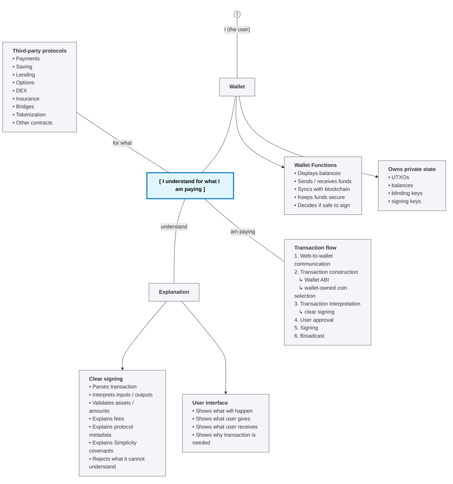

# Road to Ecosystem

Wide adoption of the Simplicity language in the Liquid ecosystem means that a variety of protocols
can be built without requiring every wallet to be directly integrated with every protocol.

There could be useful protocols that enable better saving strategies,
life insurance, payments, lending, options, tokenization, and many other on-chain financial applications.
At the same time, an open ecosystem also introduces malicious websites and misleading interfaces.

In an open ecosystem, malicious protocols cannot be prevented from appearing,
because no single party controls the ecosystem. Someone can always create a contract and misrepresent its
nature or effects, or even present a malicious contract to a counterparty.
The best available approach is to help the user understand what is going on before they sign and pay.

This document is built around a simple motto:

> I understand for what I am paying.

## The Tree

The motto can be thought of as the root of a Merkle tree. The root is simple and user-facing. The leaves are technical details.

The tree grows over time rather than being fixed once and for all.

## Wallets

Wallets are the core part of the ecosystem.

They do the heavy lifting for the user.
They display balances, send and receive funds, sync with the blockchain, manage keys,
select coins, construct transactions, and protect wallet-private information.
They are also the last line of defense before user funds move.

A protocol can ask the wallet to sign something, but the wallet should decide
whether that request is understandable and safe enough to show to the user.

A wallet has two responsibilities at the same time:

1. It must be useful enough to participate in protocols.
2. It must be strict enough to protect the user from signing something they do not understand.

This creates the first major branch of the ecosystem:

* Wallet
    * Syncs with the blockchain
    * Keeps funds secure
    * Owns wallet-private state
    * Signs transactions
    * Explains transactions before signing

## Understanding What Is Being Signed

The second part of the motto is:

> understand

This branch is directly connected to paying money and sending transactions.
When a user signs a transaction, they should understand what the transaction does.

This is the role of clear signing.

Clear signing is a set of instructions, checks, and validations that a wallet performs
to ensure that a transaction received from a third party is understandable before the wallet signs it.

A third-party protocol may prepare a request for the wallet.
That protocol could be a lending application, an options protocol, a payment application, a savings strategy, a DEX,
or any other contract that can be implemented on-chain.
The wallet should not blindly sign the transaction just because the request came through a supported transport layer.

The wallet should interpret the transaction.

By default, if the wallet cannot interpret an input or output,
it should reject the whole transaction. This is the safest default.
If a transaction cannot be explained, it should not be signed.

When the wallet can interpret everything, it should perform checks and validations to verify that the transaction
matches what the user intended. For example, the wallet should display asset details correctly,
show the amounts involved, explain fees, identify the protocol, and describe what the user is receiving in exchange.

* Clear signing
    * Explain transaction from a third party
    * Parse transaction structure
    * Interpret inputs
    * Interpret outputs
    * Identify assets
    * Verify amounts
    * Explain fees
    * Explain protocol-specific metadata
    * Explain Simplicity covenant behavior
    * Check that the request matches user intent
    * Sign only if the transaction is understandable

This becomes especially important for Simplicity contracts.

Simplicity covenants are complex, which makes wallet display much harder.
A transaction locked behind a Simplicity covenant can encode behavior that is not obvious from the transaction shape alone.
The wallet needs additional structure to explain what the covenant means, what the user is allowed to do, and what the user is committing to.

Therefore, clear signing has another branch:

* Clear signing
    * Explain the transaction to the best of the wallet's ability
        * What is being spent?
        * What is being received?
        * What asset is involved?
        * What covenant controls this transaction?
        * What protocol does this belong to?
        * What conditions will exist after signing?
        * What risks or unknowns remain?

The motivation is simple: the user should understand, without reasonable doubt, that the action being performed is the action they intended.

## Standards Around Wallet Interaction

To make this possible, the ecosystem needs shared standards.

The relevant work is happening around Elements Improvement Proposals, or ELIPs.
The [ElementsProject/ELIPs](https://github.com/ElementsProject/ELIPs) repository contains proposals for Elements and Liquid-related standards.

Two relevant draft proposals are already available:

* [Wallet ABI Transaction Creation Protocol](https://github.com/ElementsProject/ELIPs/pull/35)
* [Liquid Wallet RPC Profile](https://github.com/ElementsProject/ELIPs/pull/36)

A follow-up profile for Liquid clear signing is expected to define how wallets should parse, validate, and display clear-signing metadata.

Together, these standards describe different parts of the same tree:

* Web application
    * Communicates with wallet
        * Liquid Wallet RPC Profile
    * Asks wallet to construct or complete a transaction
        * Wallet ABI Transaction Creation Protocol
    * Provides metadata for interpretation
        * Liquid Clear Signing Profile
    * Receives a signed transaction only after user approval

These standards are not separate ideas; they are different layers of one user-safety model.

The application wants the user to participate in a protocol.
The wallet wants to protect the user.
The standards define how those two parties communicate without destroying privacy, safety, or usability.

## Third-Party Protocols

The phrase:

> for what

points to the reason the user is paying.

The user is not paying because a website asked for a signature.
The user is paying for something: a good, a service, a position in a protocol, a contract, a transfer, or a financial action.

Examples include:

* Third-party protocols
    * Payments
    * Saving strategies
    * Life insurance
    * Lending
    * Options
    * DEX protocols
    * Bridges
    * Tokenization
    * Other on-chain applications

These protocols are outside the wallet.
The wallet does not need to implement every protocol internally, and it should not be expected to understand every website by default.

However, the wallet must still understand enough to protect the user before signing.

That is the central tension of the ecosystem:

* Open ecosystem
    * Many protocols
    * Many websites
    * Many contract types
    * Many assets
    * One wallet responsibility:
        * explain the transaction before signing

The ecosystem becomes useful only if applications can innovate without waiting for every wallet to hard-code their protocol.
But the ecosystem becomes safe only if wallets can reject unknown, ambiguous, or misleading signing requests.

## Transport Layer

For third-party protocols to work, websites and wallets need a way to communicate.

This is the transport layer.

A protocol website needs to ask the wallet for some action:
connect an account, construct a transaction, sign a [PSET](../glossary.md#pset), sign a message, or send funds.
The wallet needs to receive that request, evaluate it, and show the user what is happening.

By definition, this requires an open API that allows the connection to be established.

* Third-party protocol
    * Transport layer
        * Establishes a connection with the wallet
        * Requests wallet capabilities
        * Sends protocol requests
        * Sends transaction-construction requests
        * Sends signing requests
        * Receives wallet responses
        * Preserves user privacy as much as possible

Liquid adds an important complication: confidentiality.

Liquid supports Confidential Transactions.
Confidentiality means that funds can be transferred without revealing the asset ID and amount to the public blockchain observer.
Because of this, a wallet should not disclose balances, [UTXOs](../glossary.md#utxo), or view material to a counterparty unless the user has explicitly agreed to that disclosure.

The best privacy-preserving path is described by the Wallet ABI approach.

The Wallet ABI Transaction Creation Protocol allows an application to express an application-level
intent while keeping wallet-owned UTXOs, balances, and internal selection state private to the wallet.

In this model, the application does not need to know everything about the wallet.
Instead, the application tells the wallet what kind of transaction is needed,
and the wallet constructs or completes the transaction using its own private state.

* Wallet ABI
    * Application describes intent
    * Wallet keeps private state private
    * Wallet performs coin selection
    * Wallet constructs or completes the transaction
    * Wallet prepares the signing view
    * Clear signing explains the result to the user

This is the preferred model when confidentiality matters.

## User-Approved Disclosure

There is also a second use case.

Maybe the user wants to share more information with a website.
Maybe the application needs balances or UTXOs, and the user explicitly agrees to disclose them.
In that case, the general shape of Bitcoin wallet RPC methods can be adapted for Liquid.

The [WalletConnect Bitcoin JSON-RPC methods](https://docs.walletconnect.network/wallet-sdk/chain-support/bitcoin) provide
a useful reference point for wallet-to-application RPC methods in the Bitcoin ecosystem.

For Liquid, the corresponding work is the [Liquid Wallet RPC Profile](https://github.com/ElementsProject/ELIPs/pull/36).

The Liquid profile needs to account for Liquid-specific details:

* Liquid Wallet RPC Profile
    * Liquid accounts
    * user-approved balances
    * user-approved UTXOs
    * descriptor-change events

This approach is useful when the user chooses interoperability and convenience over maximum confidentiality.

Disclosure should be explicit.
A wallet should not leak wallet-private information merely to make an application easier to build.

## Clear Signing as the Center

The transport layer lets the website talk to the wallet.

The Wallet ABI lets the website ask the wallet to construct a transaction without learning private wallet state.

The Liquid Wallet RPC Profile lets the website request wallet information when the user agrees to disclose it.

But clear signing is what ties everything back to the motto.

* Transport layer
    * delivers the request
* Wallet ABI / RPC profile
    * structures the request
* Clear signing
    * explains the request
* Wallet UI
    * asks the user for approval
* User
    * understands for what they are paying

Without clear signing, the ecosystem becomes unsafe.
The user may technically approve a transaction, but they do not know what they approved.

With clear signing, the wallet becomes an interpreter between complex protocol logic and human understanding.

## Conclusion

This document started with a simple motto:

> I understand for what I am paying.

This motto provides the structure of the ecosystem.

The "I" is represented by the wallet: the user's agent, keeper of funds, balances, keys, and private state.

The "understand" part is represented by clear signing: the procedure that allows the wallet to parse, validate, and explain a transaction before the user signs.

The "for what" part is represented by third-party protocols: payments, lending, options, savings, insurance, DEXs, tokenization, and other applications that can be built with Simplicity.

The "am paying" part is represented by transaction construction, signing, and broadcast.

Making this work requires a transport layer that allows websites and wallets to communicate,
wallet APIs that preserve Liquid confidentiality by default,
RPC methods for cases where the user explicitly agrees to disclose wallet information,
and clear signing metadata that lets the wallet explain complex Simplicity contracts to the user.

Clear signing is the most ambitious part of this vision.
It requires more than good UI. It requires standards, registries, validation logic, contract metadata, asset metadata, and wallet implementations that reject what they cannot understand.

This is the secure road to an open Simplicity ecosystem:

> introduce as many verifiable checks as possible, so the wallet can explain to the user, with high confidence, for what they are paying.
