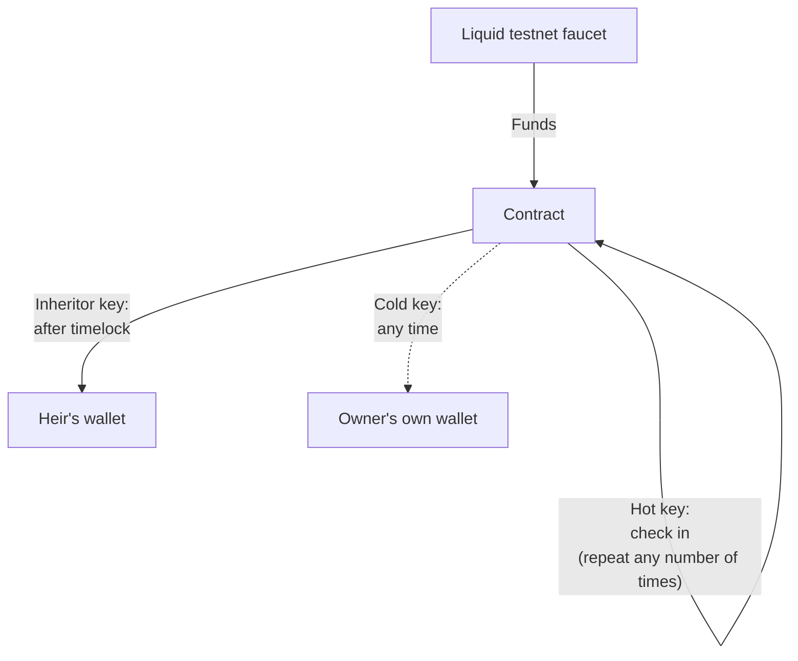

# Simplicity Quickstart

Try a real smart contract transaction on [Liquid](../glossary.md#liquid) testnet with the `last_will.simf` contract.

You'll perform a [Liquid](../glossary.md#liquid) testnet transaction using the "last will" [covenant](../glossary.md#covenant). This allows an inheritor to claim funds after a delay if their benefactor goes silent, while the benefactor can postpone that indefinitely just by checking in.

## The contract

This [smart contract](../glossary.md#smart-contract), written in [SimplicityHL](../glossary.md#simplicityhl), is called `last_will.simf`. It implements a covenant with an inheritance-after-timeout pattern, using three keys and three spending paths:

* **Hot key**: the benefactor can "check in" at any time. Checking in re-creates the exact same contract at a new [UTXO](../glossary.md#utxo) (a [recursive covenant](../glossary.md#recursive-covenant)) and resets the inheritor's timelock. This is the key the benefactor is expected to use day-to-day.
* **Cold key**: the benefactor can also break out of the covenant entirely and move the funds anywhere, no matter what the timelock says. This key would typically be kept offline, since it's only needed in unusual circumstances. This quickstart doesn't exercise this path.
* **Inheritor key**: after a [timelock](../glossary.md#timelock) has elapsed, the inheritor can claim everything.



The code (from the online <a href="https://github.com/BlockstreamResearch/SimplicityHL/blob/master/examples/last_will.simf">SimplicityHL examples</a>) looks like this:

```rust
fn checksig(pk: Pubkey, sig: Signature) {
    let msg: u256 = jet::sig_all_hash();
    jet::bip_0340_verify((pk, msg), sig);
}

fn enforce_relative_distance(min_distance: Distance) {
    // Transaction version must be at least 2 for BIP68 relative locktime to apply.
    assert!(jet::le_32(2, jet::version()));

    // Fetch and parse the current input's own sequence number.
    let actual_data: Either<Distance, Duration> = unwrap(jet::parse_sequence(jet::current_sequence()));
    let actual_distance: Distance = unwrap_left::<Duration>(actual_data);

    assert!(jet::le_16(min_distance, actual_distance));
}

// Enforce the covenant to repeat in the first output.
//
// Elements has explicit fee outputs, so enforce a fee output in the second output.
// Disallow further outputs.
fn recursive_covenant() {
    assert!(jet::eq_32(jet::num_outputs(), 2));
    let this_script_hash: u256 = jet::current_script_hash();
    let output_script_hash: u256 = unwrap(jet::output_script_hash(0));
    assert!(jet::eq_256(this_script_hash, output_script_hash));
    assert!(unwrap(jet::output_is_fee(1)));
}

fn inherit_spend(inheritor_sig: Signature) {
    let min_distance: Distance = param::MIN_DISTANCE_BLOCKS;
    enforce_relative_distance(min_distance);
    let inheritor_pk: Pubkey = param::INHERITOR_PUBLIC_KEY;
    checksig(inheritor_pk, inheritor_sig);
}

fn cold_spend(cold_sig: Signature) {
    let cold_pk: Pubkey = param::COLD_PUBLIC_KEY;
    checksig(cold_pk, cold_sig);
}

fn refresh_spend(hot_sig: Signature) {
    let hot_pk: Pubkey = param::HOT_PUBLIC_KEY;
    checksig(hot_pk, hot_sig);
    recursive_covenant();
}

enum Action {
    Inherit(Signature),
    ColdSpend(Signature),
    HotSpend(Signature),
}

fn main() {
    match witness::ACTION {
        Action::Inherit(sig: Signature) => inherit_spend(sig),
        Action::ColdSpend(sig: Signature) => cold_spend(sig),
        Action::HotSpend(sig: Signature) => refresh_spend(sig),
    }
}
```

You'll play the roles both of the benefactor and the inheritor, using two different [private keys](../glossary.md#private-key). In a real deployment, these keys would belong to different people. The benefactor would also have a "cold key", most likely kept offline.

Please choose your preferred language environment immediately below. You can also run any version [online, with no download](https://github.com/Blockstream/simplicity-codespace/).

<!-- This is the page's only tabbed block, so Material assigns its tabs the
anchors #__tabbed_1_1 (Rust) and #__tabbed_1_2 (bash/CLI), in document order,
and the "Next steps" list in each tab links to the other one by this anchor.
Reordering these tabs, or adding another tabbed block above this one, shifts
the numbering and silently breaks those links. -->

=== "Rust"

    ## Rust quickstart

    Before beginning, please <a href="https://rust-lang.org/tools/install/">make sure you have Rust installed.</a>

    ## Demo walkthrough

    !!! tip "Need help?"
        If you get stuck at any point in this tutorial, ask in the [Simplicity Community](https://community.simplicity-lang.org/) forum. Questions posted there are public, so the answer can help later readers too.

    ### 1. Clone the walkthrough git repository

    ```bash
    git clone https://github.com/BlockstreamResearch/simplicity-demo
    cd simplicity-demo
    ```

    ### 2. Create a random seed for the demo's keypairs

    Run this command to create a random seed value. (This will be used to derive keypairs used in the demo.)

    ```bash
    openssl rand -hex 32
    ```

    Create an `.env.demo` file at the top level of the `simplicity-demo` project, with a single line `SEED_HEX=` followed by your random seed value from the previous command.

    Every `last-will` command below derives its keys from this one seed, so you don't need to manage three separate seeds to play all three roles yourself. In a real deployment, these would be three unrelated seeds held on different devices.

    ### 3. Compile the last-will contract

    ```bash
    cargo run last-will compile-to-testnet-address -v
    ```

    This derives all three keypairs from the seed, substitutes their public keys (and the default `--min-distance-blocks 3`) into `last_will.simf`, and compiles it. The output will look something like this:

    ```
    # Deriving keypairs from seed.
    # Compiling SimplicityHL program source_simf/last_will.simf.

    SimplicityHL source code:
        fn checksig(pk: Pubkey, sig: Signature) {
            ...
        }

        ...

    Parameter arguments (compile-time):
        mod param {
            const COLD_PUBLIC_KEY: u256 = 0x0804...;
            const HOT_PUBLIC_KEY: u256 = 0x4f35...;
            const INHERITOR_PUBLIC_KEY: u256 = 0x55f1...;
            const MIN_DISTANCE_BLOCKS: u16 = 3;
        }
    # Deriving Liquid Testnet address.
    ---> Inheritor public key: 55f1cd1f0ebdd80e86080ab56c02fb3f65c540f880f4e5e48bc1800e74c13606
    ---> Cold public key: 08040427cb5728a184a886897f0faed50353919e24b0571de75c45ef799821be
    ---> Hot public key: 4f355bdcb7cc0af728ef3cceb9615d90684bb5b2ca5f859ab0f0b704075871aa

    Contract's Liquid Testnet address: tex1p6df7ur00f9hc3k3y2g9ls6tl963sg59vm3pe9urytupxkhlpyrestuh6nm
    ```

    (Without `-v`, you'll just see the address on the last line.) `MIN_DISTANCE_BLOCKS` defaults to 3 purely so this quickstart finishes in a few minutes, as Liquid Network blocks are created once per minute.

    ### 4. Fund the contract on Liquid testnet

    ```bash
    cargo run last-will fund-from-faucet --address tex1p6df7ur00f9hc3k3y2g9ls6tl963sg59vm3pe9urytupxkhlpyrestuh6nm
    ```

    **(Substitute the address from your own Step 3 output.)** This funds the contract with 100000 sats of tLBTC, and prints the funding transaction's ID; you'll need it for the next step. Wait for it to confirm (check <a href="https://blockstream.info/liquidtestnet/">the Explorer</a>) before continuing, since a relative timelock's clock starts at the confirming block, not at broadcast time.

    ### 5. Check in with the hot key

    This is the transaction the benefactor is expected to send periodically: it spends the current UTXO straight back to the *same contract address*, minus a fee, signed with the hot key. Producing this transaction is what resets the inheritor's timelock.

    ```bash
    cargo run last-will prove-alive --utxo <FAUCET_TXID>:0 --fee-sats 100 --broadcast
    ```

    Replace `<FAUCET_TXID>` with the transaction ID from Step 4. This derives all three keypairs again (needed to recompile the identical contract and re-derive its address), builds a transaction paying the contract's balance minus the fee back to itself, signs it with the hot key, builds the `Action::HotSpend` [witness](../glossary.md#witness), and (because `--broadcast` is set) submits it and prints the resulting txid.

    ??? "What's happening here?"
        Leave off `--broadcast` and the command prints the finalized raw transaction hex instead of submitting it.

    Wait for this transaction to confirm too, and note the block height it confirms at (visible on <a href="https://blockstream.info/liquidtestnet/">the Explorer</a>): call it `HOT_CONFIRM_HEIGHT`. The inheritor's timelock is satisfied starting at block `HOT_CONFIRM_HEIGHT + 3` (or whatever `--min-distance-blocks` you used).

    ### 6. Try to inherit early (should fail)

    With the benefactor apparently still active, the inheritor shouldn't be able to claim anything yet:

    ```bash
    cargo run last-will spend-as-inheritor \
      --utxo <HOT_TXID>:0 \
      --to-address tex1q9hgs7pj8etd92rw5qz3dymvujffxzylmj6a28h \
      --fee-sats 100 \
      --broadcast
    ```

    Replace `<HOT_TXID>` with the txid from Step 5. This derives the keys, builds a transaction spending the hot-spend UTXO to the given destination, declares a relative-locktime distance of `--min-distance-blocks` (3 by default) on the input, signs with the inheritor's key, and builds the `Action::Inherit` witness, all of which succeeds locally, since the contract's own check only compares against the *declared* distance. The broadcast, though, should fail with something like `non-BIP68-final`: the node independently checks how many blocks have *actually* passed since `<HOT_TXID>` confirmed, and it's still close to zero.

    This is the same split explained on the [Timelocks](../documentation/timelocks.md#timelock-enforcement-mechanisms) page: Simplicity checks "does this transaction's declared `sequence` satisfy my rule?"; blockchain consensus separately checks "has enough real time actually passed to accept this `sequence`?" Both conditions must be satisfied.

    ### 7. Wait, then inherit for real

    Wait until the chain tip reaches `HOT_CONFIRM_HEIGHT + 3` (watch <a href="https://blockstream.info/liquidtestnet/">the Explorer</a>, or poll it the way the [bash/CLI tab](#__tabbed_1_2) above does). At a block a minute on Liquid testnet, this should take about three minutes.

    Then run the *identical* command from Step 6 again:

    ```bash
    cargo run last-will spend-as-inheritor \
      --utxo <HOT_TXID>:0 \
      --to-address tex1q9hgs7pj8etd92rw5qz3dymvujffxzylmj6a28h \
      --fee-sats 100 \
      --broadcast
    ```

    This time it should succeed, printing a txid. You can view the completed transaction on <a href="https://blockstream.info/liquidtestnet/">the Explorer</a>.

    ### Congratulations

    You've walked a single contract through all three roles of a realistic covenant: funding it, proving activity to keep it alive, watching the network itself enforce a timelock the contract applied, and finally exercising the fallback path once that timelock had elapsed.

    ??? "See more technical details"
        All four `last-will` subcommands support the `-v` option for verbose output, including the full compiled SimplicityHL source and parameter/witness values.

    #### Next steps

    * Once you're building something real rather than following a tutorial, [Simplex](https://github.com/BlockstreamResearch/smplx) handles project scaffolding, dependencies, and test suites for larger SimplicityHL projects.
    * Read more about how relative and absolute timelocks work, and why they can only enforce *minimum* times, in [Timelocks](../documentation/timelocks.md).
    * Read more about state and recursive covenants in [Covenants & State Management](../documentation/state.md).
    * Try the same story in the [bash/CLI](#__tabbed_1_2) tab above.
    * See <a href="https://github.com/BlockstreamResearch/SimplicityHL/tree/master/examples">more example contracts</a> demonstrating other SimplicityHL language features.

=== "bash/CLI"

    ## bash/CLI quickstart

    Before beginning, please <a href="/documentation/toolchain">make sure you have installed the toolchain applications</a> (`simc` and `hal-simplicity`). You'll also need `curl` and `jq`.

    ??? note "Want to skip typing individual commands?"
        A complete script that runs every step below automatically is available at <a href="/assets/last-will-demo.sh">last-will-demo.sh</a>. Download it and run `bash last-will-demo.sh`. The walkthrough below explains what it's doing, step by step.

    ## Demo walkthrough

    !!! tip "Need help?"
        If you get stuck at any point in this tutorial, ask in the [Simplicity Community](https://community.simplicity-lang.org/) forum. Questions posted there are public, so the answer can help later readers too.

    ### 1. Save the contract

    Save the contract above as `last_will.simf`.

    ### 2. Set up parameters

    ```bash
    INTERNAL_KEY="50929b74c1a04954b78b4b6035e97a5e078a5a0f28ec96d547bfee9ace803ac0"

    PRIVKEY_INHERITOR="0000000000000000000000000000000000000000000000000000000000000001"
    PRIVKEY_COLD="0000000000000000000000000000000000000000000000000000000000000002"
    PRIVKEY_HOT="0000000000000000000000000000000000000000000000000000000000000003"

    INHERITOR_PUBLIC_KEY="0x79be667ef9dcbbac55a06295ce870b07029bfcdb2dce28d959f2815b16f81798"
    COLD_PUBLIC_KEY="0xc6047f9441ed7d6d3045406e95c07cd85c778e4b8cef3ca7abac09b95c709ee5"
    HOT_PUBLIC_KEY="0xf9308a019258c31049344f85f89d5229b531c845836f99b08601f113bce036f9"

    MIN_DISTANCE_BLOCKS=3

    DESTINATION_ADDRESS=tex1q9hgs7pj8etd92rw5qz3dymvujffxzylmj6a28h
    ```

    `INTERNAL_KEY` is the standard BIP-0341 unspendable [internal key](../glossary.md#internal-key), and the private keys are intentionally the small integers 1, 2, and 3. In a real contract these would be long random numbers, generated and held separately by each party. `DESTINATION_ADDRESS` is where the inheritor's claim will send funds; it defaults to a Liquid testnet faucet return address so nothing is wasted.

    `MIN_DISTANCE_BLOCKS` is set to 3 purely so this quickstart finishes in a few minutes. [Liquid testnet blocks land once a minute](../documentation/timelocks.md#timelock-measurement-units), so you'll only have to wait three minutes in order to inherit the contract's funds. A longer, more realistic period can be achieved by raising this number, up to a point. `Distance` is capped at 65535, which at one block a minute is only about 45 days. A real deployment wanting something like a 180-day check-in period would need to use [a different timelock enforcement method](../documentation/timelocks.md#relative-timelock-in-simplicityhl) instead.

    Now write out the `.args` file substituting these values into the contract's parameters:

    ```bash
    cat > last_will.args << EOF
    {
        "INHERITOR_PUBLIC_KEY": "$INHERITOR_PUBLIC_KEY",
        "COLD_PUBLIC_KEY": "$COLD_PUBLIC_KEY",
        "HOT_PUBLIC_KEY": "$HOT_PUBLIC_KEY",
        "MIN_DISTANCE_BLOCKS": "$MIN_DISTANCE_BLOCKS"
    }
    EOF
    ```

    ### 3. Compile and fund the contract

    Check the result of compiling the contract with the parameters from the prior step:

    ```bash
    simc -Z enums last_will.simf -a last_will.args
    ```

    (This contract uses SimplicityHL's `enum` feature, which is still experimental. Compiling it requires passing `-Z enums` to `simc`.)

    Now derive the contract's address and compute its [CMR](../glossary.md#cmr), which you'll need in later steps to attach the program to a [PSET](../glossary.md#pset):

    ```bash
    COMPILED_PROGRAM=$(simc -Z enums last_will.simf -a last_will.args --json | jq -r .program)
    CMR=$(hal-simplicity simplicity info "$COMPILED_PROGRAM" | jq -r .cmr)
    CONTRACT_ADDRESS=$(hal-simplicity simplicity info "$COMPILED_PROGRAM" | jq -r .liquid_testnet_address_unconf)
    ```

    Fund it from the Liquid testnet faucet, which provides free tLBTC assets for testing and experimentation:

    ```bash
    FAUCET_TXID=$(curl "https://liquidtestnet.com/api/faucet?address=$CONTRACT_ADDRESS&action=lbtc" 2>/dev/null | jq -r .txid)
    ```

    Wait for this transaction to confirm before continuing. You can check <a href="https://blockstream.info/liquidtestnet/">the Explorer</a>, or `curl https://blockstream.info/liquidtestnet/api/tx/$FAUCET_TXID/status` until it reports `"confirmed": true`. This matters here specifically because a relative timelock's clock starts at the confirming block, not at broadcast time, so the steps below need this input to have actually landed in a block.

    ### 4. Check in with the hot key

    This is the transaction the benefactor is expected to send periodically: it spends the current UTXO straight back to the *same contract address*, minus a [fee](../glossary.md#fee), signed with the hot key. Producing this transaction is what resets the inheritor's timelock. The covenant doesn't track a countdown anywhere; it just requires this specific action to keep happening, repeatedly creating a fresh copy of the same covenant.

    First, fetch the details of the UTXO you're about to spend:

    ```bash
    curl https://liquid.network/liquidtestnet/api/tx/$FAUCET_TXID > input-tx.json
    HEX=$(jq -r '.vout[0].scriptpubkey' < input-tx.json)
    ASSET=$(jq -r '.vout[0].asset' < input-tx.json)
    VALUE="0.00"$(jq -r '.vout[0].value' < input-tx.json)
    ```

    (FIXME: This method of converting satoshis to Bitcoin is not correct in general if the number of satoshis isn't exactly six digits long.)

    Build a [PSET](../glossary.md#pset) with two [outputs](../glossary.md#output): the refreshed contract, and an explicit fee. (This 2-output shape is exactly what `recursive_covenant()` checks for above; the contract will reject anything else.)

    ```bash
    PSET=$(hal-simplicity simplicity pset create \
      '[ { "txid": "'"$FAUCET_TXID"'", "vout": 0 } ]' \
      '[ { "'"$CONTRACT_ADDRESS"'": 0.00099900 }, { "fee": 0.00000100 } ]' \
      | jq -r .pset)

    PSET=$(hal-simplicity simplicity pset update-input "$PSET" 0 -i "$HEX:$ASSET:$VALUE" -c "$CMR" -p "$INTERNAL_KEY" | jq -r .pset)
    ```

    Sign it with the hot key, and build the witness. `witness::ACTION` needs to carry the `Action::HotSpend` enum variant along with the signature:

    ```bash
    HOT_SIGNATURE=$(hal-simplicity simplicity sighash "$PSET" 0 "$CMR" -x "$PRIVKEY_HOT" | jq -r .signature)

    cat > last_will.wit << EOF
    {
        "ACTION": "Action::HotSpend(0x$HOT_SIGNATURE)"
    }
    EOF
    ```

    Compile with the witness attached, finalize, extract, and broadcast:

    ```bash
    PROGRAM=$(simc -Z enums last_will.simf -a last_will.args -w last_will.wit --json | jq -r .program)
    WITNESS=$(simc -Z enums last_will.simf -a last_will.args -w last_will.wit --json | jq -r .witness)

    PSET=$(hal-simplicity simplicity pset finalize "$PSET" 0 "$PROGRAM" "$WITNESS" | jq -r .pset)
    RAW_TX=$(hal-simplicity simplicity pset extract "$PSET" | jq -r)

    HOT_TXID=$(curl -X POST "https://blockstream.info/liquidtestnet/api/tx" -d "$RAW_TX" 2>/dev/null)
    ```

    Wait for `HOT_TXID` to confirm before moving on: you'll need the [height](../glossary.md#height) it confirms at in a moment. Once the Explorer shows it as confirmed, fetch that height:

    ```bash
    HOT_CONFIRM_HEIGHT=$(curl -sSL https://blockstream.info/liquidtestnet/api/tx/$HOT_TXID/status | jq -r .block_height)
    ```

    ### 5. Try to inherit early (should fail)

    With the benefactor apparently still active, the inheritor shouldn't be able to claim anything yet. Let's confirm the contract actually enforces that, not just trust it.

    Fetch the hot-spend output's details, the same way as before:

    ```bash
    curl https://liquid.network/liquidtestnet/api/tx/$HOT_TXID > input-tx.json
    HEX=$(jq -r '.vout[0].scriptpubkey' < input-tx.json)
    ASSET=$(jq -r '.vout[0].asset' < input-tx.json)
    VALUE="0.00"$(jq -r '.vout[0].value' < input-tx.json)
    ```

    This time, build the PSET with a [`sequence`](../documentation/timelocks.md#creating-appropriate-transactions) value declaring a relative distance of `MIN_DISTANCE_BLOCKS`:

    ```bash
    PSET=$(hal-simplicity simplicity pset create \
      '[ { "txid": "'"$HOT_TXID"'", "vout": 0, "sequence": '"$MIN_DISTANCE_BLOCKS"' } ]' \
      '[ { "'"$DESTINATION_ADDRESS"'": 0.00099800 }, { "fee": 0.00000100 } ]' \
      | jq -r .pset)

    PSET=$(hal-simplicity simplicity pset update-input "$PSET" 0 -i "$HEX:$ASSET:$VALUE" -c "$CMR" -p "$INTERNAL_KEY" | jq -r .pset)
    ```

    Sign with the inheritor's key this time, and build an `Action::Inherit` witness:

    ```bash
    INHERITOR_SIGNATURE=$(hal-simplicity simplicity sighash "$PSET" 0 "$CMR" -x "$PRIVKEY_INHERITOR" | jq -r .signature)

    cat > last_will.wit << EOF
    {
        "ACTION": "Action::Inherit(0x$INHERITOR_SIGNATURE)"
    }
    EOF
    ```

    ```bash
    PROGRAM=$(simc -Z enums last_will.simf -a last_will.args -w last_will.wit --json | jq -r .program)
    WITNESS=$(simc -Z enums last_will.simf -a last_will.args -w last_will.wit --json | jq -r .witness)

    PSET=$(hal-simplicity simplicity pset finalize "$PSET" 0 "$PROGRAM" "$WITNESS" | jq -r .pset)
    INHERIT_RAW_TX=$(hal-simplicity simplicity pset extract "$PSET" | jq -r)
    ```

    Note that `finalize` and `extract` both **succeed**. That's expected: the contract's own check only compares against the `sequence` value you just declared, and 3 satisfies "at least 3". Now try broadcasting it anyway:

    ```bash
    curl -X POST "https://blockstream.info/liquidtestnet/api/tx" -d "$INHERIT_RAW_TX"
    ```

    This should be rejected with something like `non-BIP68-final`. The contract approved the transaction; the [node](../glossary.md#node) didn't, because it independently checks how many blocks have *actually* passed since `HOT_TXID` confirmed, and it's still close to zero. This is the same split explained on the [Timelocks](../documentation/timelocks.md#timelock-enforcement-mechanisms) page: Simplicity checks "does this transaction's declared `sequence` satisfy my rule?"; blockchain consensus separately checks "has enough real time actually passed to accept this `sequence`?" Both conditions must be satisfied.

    Hold onto `INHERIT_RAW_TX`: you'll resend the exact same bytes in Step 7, unchanged.

    ### 6. Wait

    ```bash
    TARGET_HEIGHT=$((HOT_CONFIRM_HEIGHT + MIN_DISTANCE_BLOCKS))
    echo "Waiting for block $TARGET_HEIGHT..."
    ```

    Poll the current chain tip until it reaches `TARGET_HEIGHT`:

    ```bash
    curl -sSL https://blockstream.info/liquidtestnet/api/blocks/tip/height
    ```

    At a block a minute, this should take about three minutes. Watch <a href="https://blockstream.info/liquidtestnet/">the Explorer</a> if you'd rather not poll from the command line.

    ### 7. Inherit for real

    Once the tip has reached `TARGET_HEIGHT`, resend the *identical* transaction from Step 5:

    ```bash
    curl -X POST "https://blockstream.info/liquidtestnet/api/tx" -d "$INHERIT_RAW_TX"
    ```

    This time it should be accepted, and you'll get back a txid. You can view the completed transaction on <a href="https://blockstream.info/liquidtestnet/">the Explorer</a>.

    ### Congratulations

    You've walked a single contract through all three roles of a realistic covenant: funding it, proving activity to keep it alive, watching the network itself enforce a timelock the contract applied, and finally exercising the fallback path once that timelock had elapsed.

    #### Next steps

    * Once you're building something real rather than following a tutorial, [Simplex](https://github.com/BlockstreamResearch/smplx) handles project scaffolding, dependencies, and test suites for larger SimplicityHL projects.
    * Read more about how relative and absolute timelocks work, and why they can only enforce *minimum* times, in [Timelocks](../documentation/timelocks.md).
    * Read more about state and recursive covenants in [Covenants & State Management](../documentation/state.md).
    * Try the same story in the [Rust](#__tabbed_1_1) tab above.
    * See <a href="https://github.com/BlockstreamResearch/SimplicityHL/tree/master/examples">more example contracts</a> demonstrating other SimplicityHL language features.
